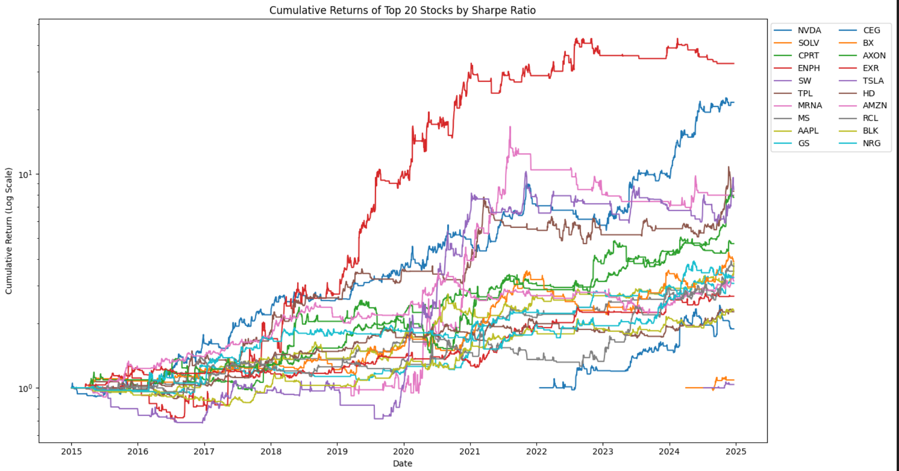

This project is a baseline for a feature based ensemble voting trading strategy. I defined a simple voting mechanism with thresholds for number of votes required to go long or short as well as a trailing threshold to determine when to close a position. I tested the baseline and an ensemble of models across all (current) S&P 500 stocks and got positive results for a large number of them. Further developing the strategy would entail training models across groups of stocks to test many combinations of features and parameters, while being less likely to overfit any one market. 

[Click here](https://github.com/billyfrog8/Ensemble/blob/main/Ensemble.ipynb) to view the full notebook. In [V2](https://github.com/billyfrog8/Ensemble/blob/main/Ensemble_V2.ipynb) I not so successfully attempted to set up a small optimization problem. Turns out a lot more compute power than I have may be needed. 

I specifically coded the binary features in a manner that I thought would lead the model to perform best on popular and volatile stocks. As seen below, this appears to have worked based on stocks like TSLA, PLTR, NVDA, MRNA etc. being among the top performers. Across these stocks, it generally appears that the models work better on the long side. One reason would be survivorship bias from not having a historical composition of the S&P 500 Index, but the other is that mean reversion should generally be expected on the downside for stocks in the index, while anti-mean reversion occurs with select stocks in the index on the upside. In my opinion, the key to model development is selecting the right markets and right times to apply them to, so having a theoretical basis for where they should work prior to development can help understand where the risk of overfitting lies.

